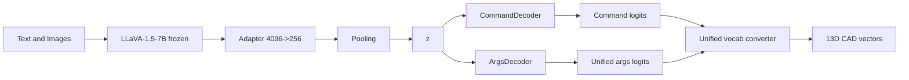

## MechCAD-MLLM

MechCAD-MLLM is a multimodal large language model system that generates CAD command
sequences from text descriptions and optional reference images. It uses a frozen
LLaVA-1.5-7B encoder and a custom Transformer decoder to produce DeepCAD-style
command sequences, which are mapped into 13D CAD vectors.

This repo contains training, evaluation, inference, and a Gradio web UI for
inspection and demo usage.

## Highlights

- Multimodal conditioning (text-only or text + images)
- Two-stage training: text-only, then multimodal with PerceiverFusion
- Unified vocabulary for CAD commands and arguments
- Geometry-aware evaluation with Chamfer Distance, SegE, and DangEL
- CLI inference and Gradio UI for quick testing

## Architecture



## Quick Start

### Environment

The project is typically run with Python 3.8. You can use conda or a virtualenv.

```bash
git submodule update --init --recursive
pip install -r CAD-MLLM/3rd_party/DeepCAD/requirements.txt
pip install gradio tensorboardX transformers torch h5py
conda install -c conda-forge pythonocc-core=7.8.1
```

### Data

The dataset is expected under `data/Omni-CAD/` with this layout:

```text
data/Omni-CAD/
	cad_vec/
	txt/
	step_img/
```

If you do not already have the dataset, you can download the Omni-CAD dataset
from Hugging Face and organize it as above. The preprocessing pipeline is based
on DeepCAD. See `CAD-MLLM/README.md` for the detailed preprocessing steps.

### Training

Stage 1 (text-only):

```bash
python src/train.py --text_only --epochs 50 --batch_size 4 --lr 1e-4
```

Stage 2 (multimodal, resume from stage 1):

```bash
python src/train.py --resume outputs/stage1/best.pth --reset_scheduler --epochs 30
```

Resume from a checkpoint:

```bash
python src/train.py --resume outputs/checkpoints/ckpt_epoch10.pth
```

### Evaluation

```bash
python src/evaluate_checkpoint.py \
	--checkpoint outputs/stage2/best.pth \
	--split test \
	--metrics_output outputs/stage2/test_metrics.json
```

Text-only checkpoint evaluation:

```bash
python src/evaluate_checkpoint.py \
	--checkpoint outputs/stage1/best.pth \
	--text_only \
	--split test
```

### Inference (CLI)

Text-only:

```bash
python src/inference.py \
	--checkpoint outputs/checkpoints/best.pth \
	--text "A cylinder with a hole"
```

Multimodal:

```bash
python src/inference.py \
	--checkpoint outputs/checkpoints/best.pth \
	--text "A cylinder" \
	--image path/to/image.png
```

Export STEP/STL and preview images:

```bash
python src/inference.py \
	--checkpoint outputs/checkpoints/best.pth \
	--text "A bracket" \
	--export_dir outputs/exports \
	--export_stl
```

### Web UI (Gradio)

```bash
python src/app.py --checkpoint outputs/stage1/best.pth --port 7860
```

The UI supports model loading, inference, and basic training log visualization
from TensorBoard event files under `outputs/`.

## Project Structure

```text
src/
	app.py                # Gradio UI
	inference.py          # CLI inference
	train.py              # Training entry
	evaluate_checkpoint.py
	model/                # Model and fusion modules
	trainer/              # Training loop and losses
	unified_vocab/        # Unified CAD tokenization
	utils/                # Geometry and export helpers
cadlib/                 # CAD primitives and macros
scripts/                # Data utilities
data/                   # Omni-CAD data
model_weights/          # LLaVA weights
outputs/                # Logs and checkpoints
```

## Notes

- Run all scripts from the project root to ensure paths resolve correctly.
- LLaVA encoder weights remain frozen; only decoder and fusion modules train.
- Checkpoints store decoder and fusion weights, not LLaVA weights.

## References

- CAD-MLLM project page: https://cad-mllm.github.io/
- Omni-CAD dataset: https://huggingface.co/datasets/jingwei-xu-00/Omni-CAD
- DeepCAD preprocessing base: https://github.com/ChrisWu1997/DeepCAD
